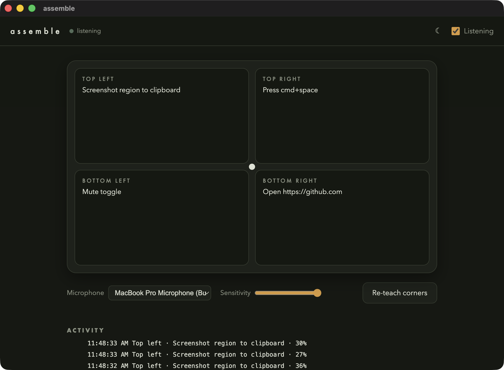
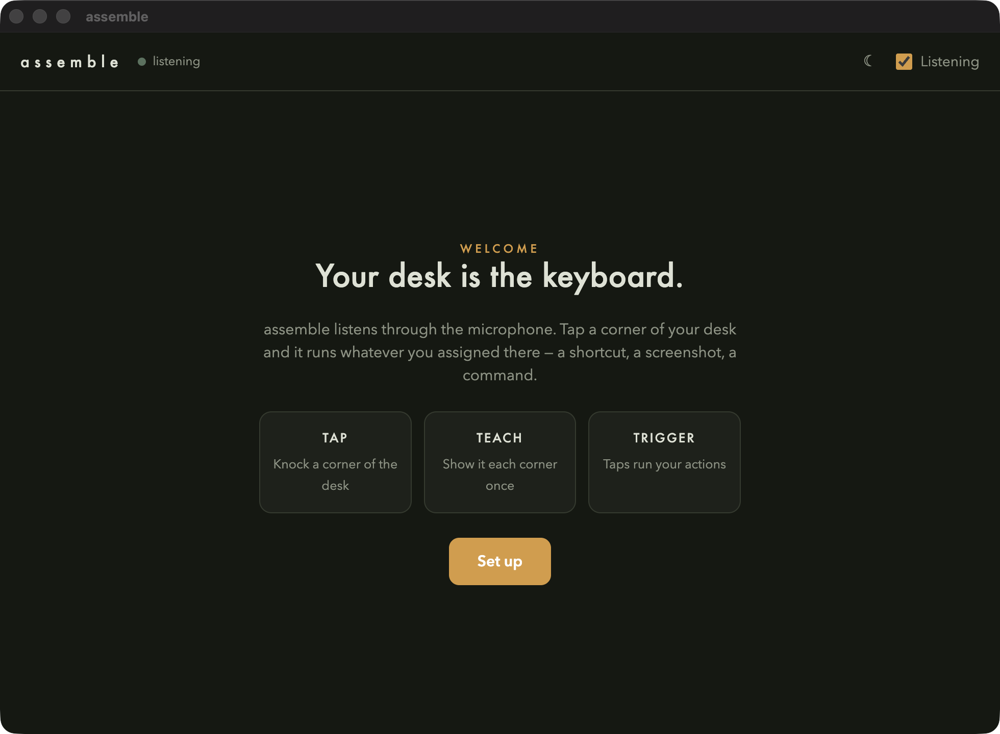
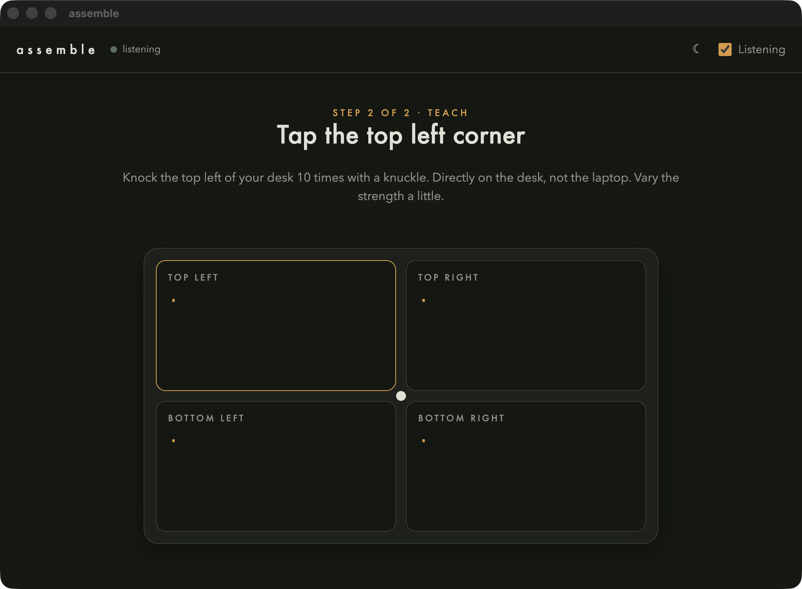
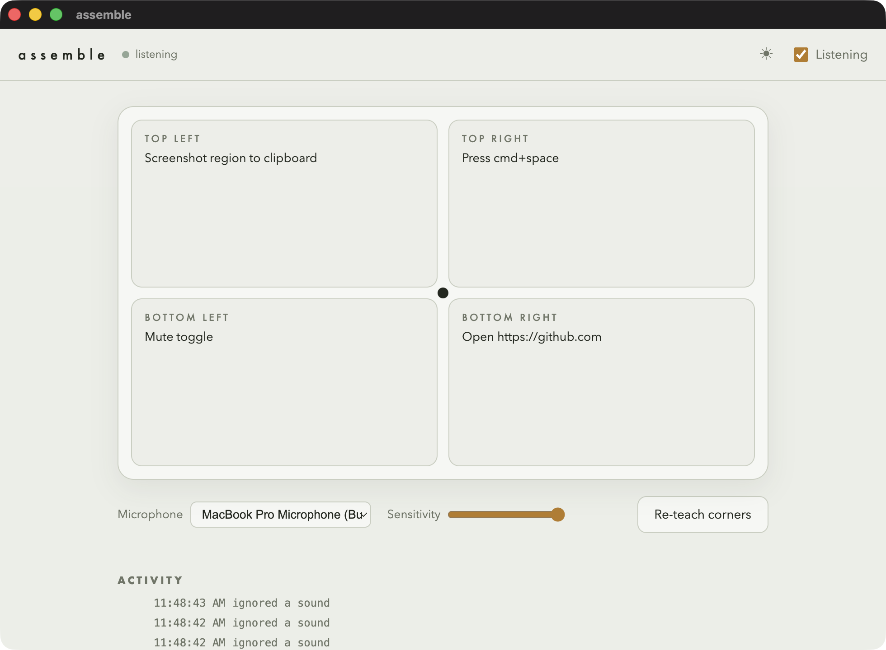

# assemble ◉

**Your desk is the input device.** Tap corners, knock rhythms, whistle, blow, wave — assemble turns everyday physical gestures into programmable actions. No extra hardware: the microphone does most of it, the camera (optional, local-only) does the rest.

- **Tap a corner** of the desk → its action runs. Four corners × three rhythms (1×, 2×, 3× knocks) = up to twelve buttons.
- **Whistle** and slide the pitch up/down → system volume follows, like an invisible knob.
- **Blow at the mic** → one more trigger (classic: sleep the display).
- **Wave a hand** left or right of the screen → two more, via low-res local motion detection.



## How it works

One mic can't triangulate, but each desk corner *sounds different* at the mic — distance, desk resonance, timbre. So:

1. **Detect** — continuous stream; a sharp energy spike + fast decay = tap candidate.
2. **Fingerprint** — ~46 ms around the onset → FFT → 32 log-spaced band energies, gain-normalized.
3. **Classify** — k-nearest-neighbors against the samples you taught it. Fires only when the match is close *and* clearly better than the runner-up; everything else (typing, claps, mugs) is ignored.
4. **Act** — corner → your action. 300 ms cooldown against double-fires.

**Constraint:** the mic must stay where it was during teaching. Moved your laptop? Re-teach.

## Install

```bash
git clone https://github.com/MananDesai54/assemble.git
cd assemble
npm install
npm start
```

Requires macOS. First launch asks for microphone access — allow it.

If macOS claims "Electron.app contains malware": XProtect false-positive on stale Electron dev builds. `npm install --save-dev electron@latest`, then `node node_modules/electron/install.js`.

## Usage guide

### 1. First run — setup



Click **Set up**. Pick your microphone and tap the desk — the level meter should jump. If it doesn't, choose a different input or check System Settings → Privacy & Security → Microphone.

### 2. Teach the corners



The highlighted corner on the desk map is the one to tap. Knock that corner of your **desk** 10 times with a knuckle, varying strength a little. The map mirrors your real desk; the dot in the middle is your mic.

Made a mess of a corner? **Redo this corner**, **Previous corner**, and **Start over** are right under the count.

After the four corners: the **ignore** phase. For ten seconds, make every sound that should NOT trigger anything — type, click, clap, set a mug down. Don't skip this; it's what stops random noise from firing your actions.

**Teaching tips**

- Tap the desk, not the laptop — chassis taps all sound identical at the mic and usually clip.
- Corners far apart beat spots near each other. Wood desks work best.
- Teach with the room in its normal state (music on if it's usually on).

### 3. Assign actions

Click a corner card — each corner takes up to three actions, one per knock pattern (**1×**, **2×**, **3×**). Knocks in quick succession (< 0.6 s apart) count as one pattern, so two fast knocks fire the 2× action. Single-tap actions fire ~0.7 s after the tap (the app waits to see if more knocks follow).

| Action | Value example | Notes |
|---|---|---|
| System action | screenshot (full / region), volume up/down, mute, lock screen, sleep display | screenshots go to clipboard; needs Screen Recording permission |
| Run a command | `say "hello"` | anything zsh runs |
| Press a shortcut | `cmd+shift+4` | needs Accessibility permission (System Settings → Privacy & Security) |
| Open app or link | `https://github.com` or `/Applications/Spotify.app` | |

### More triggers (below the desk map)

- **Whistle slides system volume** — sustain a whistle and bend the pitch up/down; each ~semitone step nudges the volume. Toggle it on, whistle a slide, watch the volume HUD.
- **Blow at the mic** — half a second of sustained blowing fires its assigned action. Tuned to ignore taps (too short) and whistles/speech (too tonal).
- **Hand waves (camera)** — off by default. When enabled, a 160×120 local motion check watches for a sustained wave on the left or right half of the frame; each side gets its own action. Frames are processed in memory and never stored or sent anywhere. First enable prompts for camera permission.

### 4. Daily use



- Every sound the app hears ripples from the mic dot; a recognized tap lights its corner and shows up in **Activity** with its confidence.
- **Listening** switch (top right, or the ◉ menubar item) is the master arm/disarm — flip it off for meetings.
- **Sensitivity**: left = softer taps register; right = only hard knocks.
- **☀/☾** toggles light/dark; follows your system by default.
- Closing the window hides it — listening continues in the background. Quit from the menubar.

## Troubleshooting

| Symptom | Fix |
|---|---|
| Wrong corner detected | Re-teach; tap positions farther apart |
| Taps missed | Sensitivity slider left |
| Random fires | Slider right; re-teach with a longer, louder ignore phase |
| "ignored a sound" for real taps | Re-teach — your tap now differs from the samples (mic moved, different knuckle) |
| Meter dead | Wrong input device, or mic permission missing |
| Double-tap fires 1× action | Knock faster — gaps over 0.6 s split the pattern |
| Whistle does nothing | Enable the toggle; whistle steadily first, then bend the pitch |
| Waves don't register | Wave one hand at one side only — motion on both halves is ignored (someone walking by shouldn't trigger it) |

## Development

TypeScript monorepo on Bun workspaces:

```
apps/desktop      Electron app (esbuild-bundled TS)
apps/server       local daemon :4817 — Slack intake, SQLite, AI endpoints
packages/core     shared types + zone model
packages/dsp      pure audio DSP — no Electron dependency, tested in Node
packages/actions  action model + macOS executor
packages/llm      llama-server client + prompts (urgency, digest, drafts)
packages/stt      whisper.cpp wrapper (local speech-to-text)
```

```bash
bun install
bun test              # vitest suite
bun test apps/server/tests-bun   # bun:sqlite tests
bun run typecheck
bun start             # build + launch desktop app
bun run server        # local daemon (Slack + AI endpoints)
```

### Local AI (no cloud, ever)

```bash
scripts/setup-models.sh   # brew: llama.cpp + whisper.cpp; downloads whisper medium (~1.5 GB)
scripts/start-llm.sh      # Gemma 4 12B Q4_K_M via llama-server on :4820 (first run downloads ~7 GB)
```

With the server + LLM running:

- **Urgent pings** — every captured Slack message is triaged by Gemma locally; genuinely urgent ones raise a macOS notification.
- **Digest** — button in the Slack pane summarizes everything since your last digest.
- **Draft replies** — click any message in the pane → local draft appears → edit → "Send to Slack". Nothing sends without your click.

### Slack setup

Socket Mode (no public URL): enable Socket Mode on your Slack app, create an app-level
token with `connections:write`, put it in `.env` as `SLACK_APP_TOKEN` alongside
`SLACK_BOT_TOKEN`. Bot must be invited to channels you want captured.

Config lives at `~/Library/Application Support/assemble/config.json` — delete it for a factory reset.

Roadmap (Slack intake, local Gemma 4 via llama.cpp, whisper.cpp call transcription, voice actions): `docs/superpowers/specs/2026-07-25-assemble-platform-design.md`.
