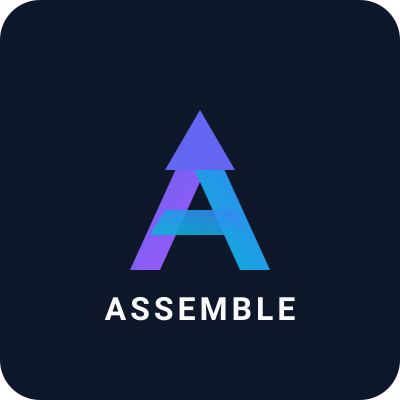

<p align="center"></p>

**Your desk is the input device.** Knock it, whistle at it, wave over it, talk to it — assemble is a local-first desk assistant that turns physical gestures and voice into programmable actions, with a fully on-device AI stack (whisper + Gemma + Kokoro). No extra hardware: the microphone does most of it, the camera (optional, local-only) does the rest.

- **Tap a corner** of the desk → its action runs. Four corners × three rhythms (1×, 2×, 3× knocks) = up to twelve buttons.
- **Talk to it** — hold **fn** and speak; whisper hears you, the local brain answers, Kokoro speaks back. Persisted chats, pick a voice.
- **Fn+Space anywhere** → floating quick-ask panel (Spotlight-style), answer inline or continue in the app.
- **Whistle** and slide the pitch up/down → system volume follows, like an invisible knob.
- **Blow at the mic** → one more trigger (classic: sleep the display).
- **Wave a hand** left or right of the screen → two more, via low-res local motion detection.
- **Record calls** with live transcription; **Slack** messages stream in; **Claude Code** runs from the Workflows page.


## Your data stays on your machine

Everything assemble hears, captures, or generates is stored **locally** — nothing is
uploaded, no telemetry, no accounts:

| What | macOS | Linux |
|---|---|---|
| App config (calibration, actions, theme) | `~/Library/Application Support/assemble/config.json` | `~/.config/assemble/` |
| SQLite (Slack messages, recordings, sessions, tokens) | `~/Library/Application Support/assemble/data/` | `~/.local/share/assemble/data/` |
| Call recordings + voice clips | `…/assemble/data/recordings`, `…/data/voice` | same, under `.local/share` |
| Whisper + Kokoro models | `…/assemble/models/` | `~/.local/share/assemble/models/` |
| Brain GGUFs (Gemma / gpt-oss) | `~/Library/Caches/llama.cpp/` | `~/.cache/llama.cpp/` |

Override the server storage root with `ASSEMBLE_HOME=/path`.

AI runs **on-device** by default (llama.cpp + whisper.cpp). The **single exception**
is opt-in BYOK: if you switch Brain source to your own API key, Slack messages,
transcripts, and drafts are sent to that provider — the UI warns you before enabling
it. Mic and camera never start without an explicit prompt each launch, and
Settings → General has a **Wipe everything** factory reset.

## How it works

One mic can't triangulate, but each desk corner *sounds different* at the mic — distance, desk resonance, timbre. So:

1. **Detect** — continuous stream; a sharp energy spike + fast decay = tap candidate.
2. **Fingerprint** — ~46 ms around the onset → FFT → 32 log-spaced band energies, gain-normalized.
3. **Classify** — k-nearest-neighbors against the samples you taught it. Fires only when the match is close *and* clearly better than the runner-up; everything else (typing, claps, mugs) is ignored.
4. **Act** — corner → your action. 300 ms cooldown against double-fires.

**Constraint:** the mic must stay where it was during teaching. Moved your laptop? Re-teach.

## Install

One line — installs bun if needed, clones, and launches:

```bash
curl -fsSL https://manandesai54.github.io/assemble/install.sh | sh
```

Or by hand:

```bash
git clone https://github.com/MananDesai54/assemble.git
cd assemble
bun install
bun start
```

Requires macOS or Linux + [Bun](https://bun.sh). (Linux: keystrokes need `xdotool`, recording needs `ffmpeg`; call recording captures mic only — system-audio capture is macOS-only for now. The Cmd+Shift chord is macOS-only; use Ctrl+Shift+Space.) That's the whole setup — the app starts its own
local server and walks you through everything else (mic, teaching, AI engines, Slack)
in the onboarding.

If macOS claims "Electron.app contains malware": XProtect false-positive on stale Electron dev builds. Reinstall electron and rerun.

## Usage guide

### 1. First run — setup


Fresh installs land on a full-screen intro — **Get started** walks through microphone,
teaching, local AI, and connections with a progress stepper; every step skippable.
Pick your microphone and tap the desk — the level meter should jump. If it doesn't, choose a different input or check System Settings → Privacy & Security → Microphone.

### 2. Teach the corners


The highlighted corner on the desk map is the one to tap. Knock that corner of your **desk** 10 times with a knuckle, varying strength a little. The map mirrors your real desk; the dot in the middle is your mic.

Made a mess of a corner? **Redo this corner**, **Previous corner**, and **Start over** are right under the count.

After the four corners: the **ignore** phase. For ten seconds, make every sound that should NOT trigger anything — type, click, clap, set a mug down. Don't skip this; it's what stops random noise from firing your actions.

**Teaching tips**

- Tap the desk, not the laptop — chassis taps all sound identical at the mic and usually clip.
- Corners far apart beat spots near each other. Wood desks work best.
- Teach with the room in its normal state (music on if it's usually on).

### 3. Assign actions

Click a corner card — each corner takes up to three actions, one per knock pattern (**1×**, **2×**, **3×**). Knocks in quick succession (< 0.6 s apart) count as one pattern, so two fast knocks fire the 2× action. Single-tap actions fire ~0.7 s after the tap (the app waits to see if more knocks follow).

| Action | Value example | Notes |
|---|---|---|
| System action | screenshot (full / region), volume up/down, mute, lock screen, sleep display | screenshots go to clipboard; needs Screen Recording permission |
| Run a command | `say "hello"` | anything zsh runs |
| Press a shortcut | `cmd+shift+4` | needs Accessibility permission (System Settings → Privacy & Security) |
| Open app or link | `https://github.com` or `/Applications/Spotify.app` | |

### More triggers (Settings → Gestures)

- **Whistle slides system volume** — sustain a whistle and bend the pitch up/down; each ~semitone step nudges the volume. Toggle it on, whistle a slide, watch the volume HUD.
- **Blow at the mic** — half a second of sustained blowing fires its assigned action. Tuned to ignore taps (too short) and whistles/speech (too tonal).
- **Hand waves (camera)** — off by default. When enabled, a 160×120 local motion check watches for a sustained wave on the left or right half of the frame; each side gets its own action. Frames are processed in memory and never stored or sent anywhere. First enable prompts for camera permission.

### 4. Daily use


- Flipping **Listening** on asks for consent before the mic (and camera, if waves are enabled) starts; once granted, the switch's state persists and sensors resume silently on later launches.
- Every sound the app hears ripples from the mic dot; a recognized tap lights its corner and shows up in **Activity** with its confidence.
- **Listening** switch (bottom of the sidebar, or the ◉ menubar item) is the master arm/disarm — flip it off for meetings.
- **Sensitivity**: left = softer taps register; right = only hard knocks.
- **☀/☾** toggles light/dark; follows your system by default.
- Closing the window hides it — listening continues in the background. Quit from the menubar.

## Troubleshooting

| Symptom | Fix |
|---|---|
| Wrong corner detected | Re-teach; tap positions farther apart |
| Taps missed | Sensitivity slider left |
| Random fires | Slider right; re-teach with a longer, louder ignore phase |
| "ignored a sound" for real taps | Re-teach — your tap now differs from the samples (mic moved, different knuckle) |
| Meter dead | Wrong input device, or mic permission missing |
| Double-tap fires 1× action | Knock faster — gaps over 0.6 s split the pattern |
| Whistle does nothing | Enable the toggle; whistle steadily first, then bend the pitch |
| Waves don't register | Wave one hand at one side only — motion on both halves is ignored (someone walking by shouldn't trigger it) |

## Development

TypeScript monorepo on Bun workspaces:

```
apps/desktop      Electron app — React 19 + Tailwind v4 + shadcn-style UI +
                  framer-motion, esbuild-bundled; WebGL "Threads" background
apps/server       local daemon :4817 — Slack intake, SQLite, AI endpoints (talk, TTS, setup)
packages/core     shared types + zone model
packages/dsp      pure audio DSP — no Electron dependency, tested in Node
packages/actions  action model + macOS executor
packages/llm      llama-server client + prompts (call summaries, voice intents)
packages/stt      whisper.cpp wrapper (local speech-to-text)
packages/integrations       pluggable third-party connectors — hidden until connected
packages/integrations/slack   user-token polling intake (listen-only) + manifest
packages/integrations/linear  assigned issues + manifest
```

```bash
bun install
bun test              # vitest suite
bun test apps/server/tests-bun   # bun:sqlite tests
bun run typecheck
bun start             # build + launch desktop app
bun run server        # local daemon (Slack + AI endpoints)
```

**Integrations** — Each integration is one package under `packages/integrations/` exporting a manifest (`connectFields`, `start/stop`, `status`, `routes`) plus one line in `apps/server/src/integrations.ts`. The registry auto-discovers them; UI appears from the manifest.

### Local AI (in-app setup)

Onboarding's **Brain** step — or Settings → Local AI anytime — installs everything
with one click and live progress:

- llama.cpp + whisper.cpp (via Homebrew)
- your chosen **speech model** — whisper small (0.5 GB, fastest) / large-v3-turbo (1.6 GB, recommended, strong Hindi/Hinglish) / large-v3 (2.9 GB, max accuracy); language auto-detected
- **Kokoro** neural TTS (~90 MB ONNX) — the voice that speaks Talk replies
- call capture + hotkey helpers (compiled locally)
- your chosen **brain** via llama-server — Gemma 4 E4B (light, 8 GB RAM) / **Gemma 4 12B** (recommended, strong multilingual) / Gemma 4 26B-A4B (big MoE, 24 GB+) / gpt-oss-20b (OpenAI open-weight, English-first)

Both dropdowns show download size, RAM needs, and strengths; switching the brain
hot-restarts llama-server. Local by default — the brain powers call summaries and
voice-command intents. Slack messages are deliberately **LLM-free** for now: they
are captured and stored, nothing more.

### Bring your own key (optional)

Settings → Local AI → Brain source. Default is **local** (private). Switch to
**Your API key** for any OpenAI-compatible provider — OpenAI, OpenRouter, Groq,
Gemini, Anthropic's compat endpoint — with base URL + key + model id and a live
test button. Clearly flagged in the UI: with BYOK, Slack messages, transcripts,
and drafts are sent to that provider.

### Slack

Paste your **user token** (`xoxp-…`, api.slack.com → your app → OAuth & Permissions →
User OAuth Token) into onboarding's **Connect** step or Settings → Integrations. It listens
to what *you* can read — every channel and DM you're in, no bot invites, no Socket Mode, no
public URL. **New messages only**, two transports:
- **Instant push** (recommended): also paste an `xapp-…` app token (Basic Information →
  App-Level Tokens, scope `connections:write`; Socket Mode on; Event Subscriptions →
  *user* events `message.channels/groups/im/mpim`). Messages arrive the moment they're
  sent — an Events-API webhook without the public URL.
- **Polling fallback** (user token alone): every conversation polled continuously —
  active ones ~2 s, quiet ones ~15 s, budgeted under Slack's rate limits. No history is fetched, no AI touches them; they land in
the local database and the live feed on the Workflows page. DMs need
the `im:read` user scope on your app — without it they're skipped automatically.
`.env` (`SLACK_USER_TOKEN`) works as a fallback for headless runs.

### Talk — voice chat with the local brain

The **Talk** page is a full voice assistant, all on-device: hold **fn** and speak
(release to send), or just type. whisper transcribes, the local brain replies in 1–3
spoken sentences, **Kokoro** (neural TTS, ~90 MB ONNX) says it out loud — pick from
11 voices in Settings → Local AI, with preview. Chats persist with automatic titles;
long conversations fold older turns into a running summary so context never
overflows. **Esc** interrupts; talking over a reply barges in. Devanagari replies
automatically switch to the system Hindi voice (Kokoro is English-only).

### Quick ask — Fn+Space, anywhere

A frameless Spotlight-style panel from any app: **Fn+Space**, type, **↵** for an
inline answer or **⌘↵** to continue in the app as a fresh Talk chat. **Esc** closes.

### Voice commands

Press and release **Cmd+Shift** alone, anywhere (listen-only key tap — real shortcuts like Cmd+Shift+4 never trigger it; needs Input Monitoring permission; Ctrl+Shift+Space fallback) — or assign **🎙 Voice command** to
any gesture: triple-knock a corner, blow at the mic, wave. Speak; it stops on silence.
whisper transcribes locally, Gemma maps it to a closed set of safe intents:

> "record this call" → recording · "take a screenshot" · "volume up" · "mute" ·
> "lock screen" · "open github.com" · "open Spotify"

Deliberately **no arbitrary shell from voice** — a misheard sentence must never execute
a command you didn't choose. Unknown requests are ignored and shown as "no match".

### Workflows — Claude Code

The **Workflows** page runs **Claude Code** sessions in any repo: pick the working
directory (recent dirs remembered, e.g. `~/midgard/api`), write the prompt, hit Run.
Sessions run headless (`claude -p`), show live status, and store their output — click
a session to read it, stop it mid-run if needed. Up to 3 concurrent. When Slack is
connected, its live message feed shows here too. Linear connects in Settings →
Integrations but is intentionally inert for now — the key is stored, nothing is fetched.

Permission model: sessions default to `acceptEdits` (Claude can edit files in that repo
but not run arbitrary commands). The "Skip permission prompts" toggle hands the session
full autonomy in that directory — per run, never sticky.

### Call recording

**● Record** in the Calls pane — or assign the "Record call (start/stop)" preset to any
gesture (double-knock a corner, blow at the mic…). Captures both sides: your mic +
system audio (ScreenCaptureKit; Screen Recording permission prompted on first use).
Transcription is **live**: whisper processes each ~10 s of audio as the call runs, so
stopping even a very long call finishes in seconds. Summaries are **on demand** — click
a finished recording → **Generate summary**; Gemma summarizes in rolling chunks (each
round sees the summary so far + the next slice), so any call length works. Everything lands in
the Calls pane and stays on disk under your data directory (see \"Your data stays on your machine\").

A macOS notification fires whenever recording starts, and **● REC** shows in the app —
recording other people without telling them is illegal in many places. Tell your call.

Factory reset: Settings → General → **Wipe everything** (keeps downloaded models/engines; wipes all personal data).

Roadmap (Slack intake, local Gemma 4 via llama.cpp, whisper.cpp call transcription, voice actions): `docs/superpowers/specs/2026-07-25-assemble-platform-design.md`.
